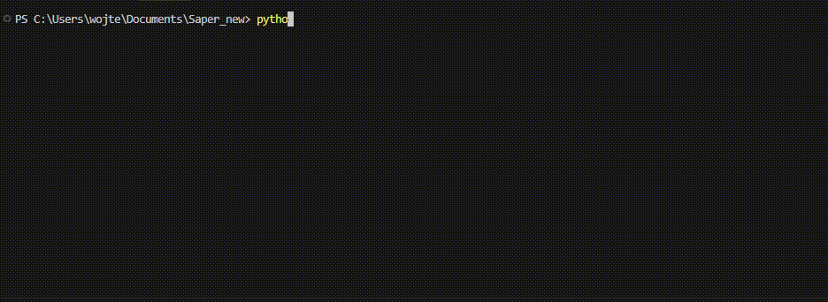

# XVunit

[](LICENSE)
[](https://www.python.org/)

**Run VUnit-style SystemVerilog testbenches on AMD/Xilinx Vivado XSim.**




## Why it exists

Necessity is the mother of invention as thay say. [VUnit](https://vunit.github.io/) is a great unit-testing framework, but it does not support the Vivado simulator as of today ([VUnit#209](https://github.com/VUnit/vunit/issues/209)).
If you need some lightweight unit tests for your project like me - this is the right repository for you.  

## About 

XVunit drives `xvlog`, `xvhdl`, `xelab` and `xsim` directly from the command
line. It gives you VUnit's familiar `` `TEST_CASE `` and `` `CHECK_EQUAL ``
macros, per-test-case pass/fail reporting, incremental recompilation and
optional XSim GUI runs.

> XVunit is an independent project and is **not affiliated with or endorsed
> by the [VUnit](https://vunit.github.io/) project**. It reuses VUnit's
> SystemVerilog test runner under the MPL-2.0 (see [License](#license)).

## Requirements

- Python 3.10 or newer.
- `colorama`: `pip install -r requirements.txt`
- AMD Vivado with its simulator tools (`xvlog`, `xvhdl`, `xelab`, `xsim`).
  Tested with Vivado 2023.1 on Windows 11. Linux is supported by the code
  but has not been tested yet; reports are welcome.

XVunit finds Vivado in this order:

1. The `XVUNIT_VIVADO_PATH` environment variable, pointing at the install
   folder, e.g. `C:\Xilinx\Vivado\2023.1` or `/tools/Xilinx/Vivado/2023.1`.
2. `xvlog` on your `PATH`, e.g. after sourcing Vivado's `settings64.sh`.
3. The newest version in the default install locations
   (`C:\Xilinx\Vivado\*`, `/tools/Xilinx/Vivado/*`, `/opt/Xilinx/Vivado/*`).

## Try the example

```sh
git clone https://github.com/wmiskowicz/XVunit.git
cd XVunit
pip install -r requirements.txt
python examples/counter/run.py
```

This compiles a small [counter](examples/counter/counter.sv) and runs the four
test cases in its [testbench](examples/counter/counter_tb.sv).

## Using it in your project

Add XVunit as a git submodule in the root of your HDL project. The folder
must be named `XVunit`, because the run scripts import it under that name.

```sh
git submodule add https://github.com/wmiskowicz/XVunit.git XVunit
```

Then copy [`run_template.py`](run_template.py) to your project root, rename it
(e.g. `run_my_module.py`) and point `sources` at your files. Glob patterns are
expanded. Always include XVunit's own runtime package:

```python
sources = {
    "rtl": [
        os.path.join(PROJECT_DIR, "rtl", "my_module", "*.sv"),
    ],
    "sim": [
        os.path.join(PROJECT_DIR, "sim", "my_module", "*.sv"),
        os.path.join(PROJECT_DIR, "XVunit", "internals", "verilog", "*.sv"),
    ],
}
```

### Project layout and conventions

Directory names for your RTL and testbenches are up to you. What matters:

```
my_project/
├── XVunit/                 # this repository, as a submodule
├── run_my_module.py        # copied from XVunit/run_template.py
├── xvunit_out/             # build output and logs (can be set as env variable)
├── rtl/...                 # sources
└── sim/my_module/
    ├── my_module_tb.sv     # module name must equal the file name
    └── my_module_tb.wcfg   # optional waveform layout for -g
```

- **A testbench is discovered** only if its file contains `` `TEST_CASE ``
  and includes `xvunit_defines.svh`.
- **The testbench module name must match its file name**, e.g. module
  `my_module_tb` lives in `my_module_tb.sv`.
- **All files in `sources` are compiled together** into one library, `work`.
  Files whose names contain `_pkg` or `_if` are compiled first.
- **Build output** goes to `<project>/xvunit_out`. Set `XVUNIT_BUILD_DIR`
  to change it.

## Writing a testbench

```systemverilog
`include "xvunit_defines.svh"

module my_module_tb;
  // ... clock, DUT instance ...

  `TEST_SUITE_BEGIN

    `TEST_CASE_SETUP begin
      // runs before every test case, e.g. reset the DUT
    end

    `TEST_CASE("resets_to_zero") begin
      `CHECK_EQUAL(dut.counter, 0);
    end

    `TEST_CASE("counts_up") begin
      repeat (3) @(negedge clk);
      `CHECK_EQUAL(dut.counter, 3, "optional message");
    end

  `TEST_SUITE_END

  `WATCHDOG(1ms);  // fail if the suite hangs
endmodule
```

Wrap each test case body in `begin ... end`. The macros expand to an `if`, so
without it only the first statement belongs to the test case. Place
`WATCHDOG` after `TEST_SUITE_END` See [`example testbench`](examples/counter_tb.sv).

Available macros: `CHECK_EQUAL`, `CHECK_NOT_EQUAL`, `CHECK_GREATER`,
`CHECK_LESS`, `CHECK_EQUAL_VARIANCE`, `WATCHDOG`, `TEST_SUITE_SETUP`,
`TEST_SUITE_CLEANUP`, `TEST_CASE_SETUP` and `TEST_CASE_CLEANUP`. See
[`xvunit_defines.svh`](internals/verilog/xvunit_defines.svh).

## Command line

```sh
python run_my_module.py                            # run every testbench
python run_my_module.py -l                         # list testbenches and test cases
python run_my_module.py my_module_tb               # run one testbench
python run_my_module.py my_module_tb.counts_up     # run one test case
python run_my_module.py "my_module_tb.count*"      # glob patterns work too
python run_my_module.py my_module_tb.counts_up -g  # open in the XSim GUI
python run_my_module.py my_module_tb -v            # verbose tool output
```

| Flag | Description |
|------|-------------|
| `-l` | List all discovered testbenches and test cases |
| `-g` | Open the simulation in the XSim GUI. Uses a `.wcfg` next to the testbench if present |
| `-v` | Stream raw `xvlog`/`xelab`/`xsim` output |
| `-h` | Print help |

## Limitations

- **Testbenches must be SystemVerilog.** RTL may be SystemVerilog, Verilog
  or VHDL, but VHDL testbenches using VUnit's VHDL library are not supported.
- **Only a subset of VUnit is ported**: the test runner and the check macros
  above. There is no VUnit Python API (`add_library`, configurations,
  generic/parameter sweeps), no parallel test execution, no JUnit/xUnit
  report and no logging or verification component libraries.
- **The process exit code does not reflect test results.** It reports
  whether compilation, elaboration and simulation launched successfully.
  Check the printed summary or the per-test-case `.log` files under
  `xvunit_out/`. This matters for CI.
- **All test cases of a testbench run in one simulation**, so state can
  leak between them. Use `TEST_CASE_SETUP` to reset the DUT.

## Repository layout

```
XVunit/
├── path_settings.py          # Vivado detection and build directory
├── run_template.py           # copy this to your project root
├── requirements.txt
├── examples/counter/         # runnable example
└── internals/
    ├── python/               # the runner
    │   ├── xvunit.py         # entry point (XVunit class) and CLI
    │   ├── xvunit_runner.py  # compile / elaborate / simulate
    │   ├── parser.py         # xsim.log tailing, pass/fail reporting
    │   ├── test_bench.py     # testbench and test case discovery
    │   ├── file_manager.py   # .prj file generation
    │   └── logger.py         # summary printing
    └── verilog/              # SystemVerilog runtime (from VUnit, MPL-2.0)
        ├── xvunit_defines.svh
        └── xvunit_pkg.sv
```

## License

XVunit's own code is licensed under the [MIT License](LICENSE). That covers
everything except the two files below.

`internals/verilog/xvunit_pkg.sv` and `internals/verilog/xvunit_defines.svh`
are adapted from [VUnit](https://github.com/VUnit/vunit), Copyright © Lars
Asplund, and remain licensed under the **Mozilla Public License 2.0** per
their file headers. See [`THIRD_PARTY_LICENSES.md`](THIRD_PARTY_LICENSES.md).
All credit for the test runner design and macro set goes to the VUnit project.
